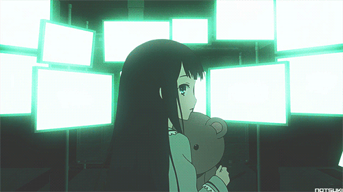
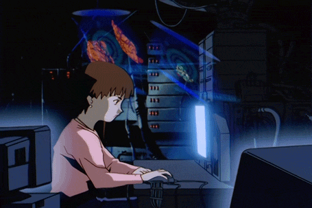

<p align="center">
  
</p>

<h2 align="center">
  <em>About Me</em>
</h2>

<br/>

<table>
  <tr>
    <td width="65%" valign="top">

Hi, I’m a curious student who loves exploring weird and interesting things — from the human brain and AI to coding, robotics, space, and creative projects.

I enjoy learning how things work, building small experiments, and turning random ideas into real projects. My main interests are <b>Artificial Intelligence</b>, <b>coding</b>, <b>robotics</b>, <b>space science</b>, and understanding the strange beauty of the human mind.

I believe curiosity is my strongest skill. I may not know everything yet, but I’m always ready to learn, build, fail, fix, and grow.

  </td>
  <td width="35%" align="center" valign="top">
    
  </td>
  </tr>
</table>

---

### 🚀 What I’m Interested In

- 🤖 Artificial Intelligence
- 💻 Coding & software projects
- 🧠 Human brain and psychology
- 🛠️ Robotics and electronics
- 🌌 Space science and futuristic ideas
- 🎮 AI in games and simulations

---

### ⚡ My Mindset

> Learning. Building. Failing. Fixing. Repeating.

I’m here to improve every day, create useful things, and turn crazy ideas into something real.
```
